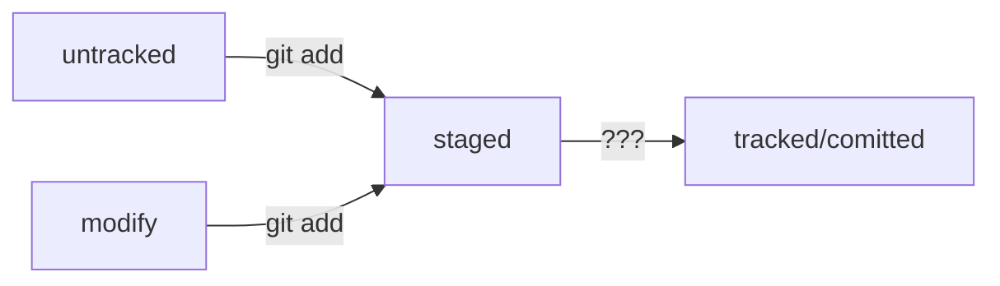

# Шпаргалка по командам гит  
+ __git init__ - инициализирует локальный репозиторий. 
+ __git add__ - добавляет файл в будущий коммит. 
+ __git status__ - отображает текущее состояние репозитория. 
+ __git add --all__ - подготавливает все файлы к коммиту. 
+ __git commit -m <message>__ - коммитит (фиксирует состояние репозитория). 
+ __git log__ - отображает историю коммитов
+ __git add remote origin *<link>*__ - связывает локальный репозиторий с удаленным. 
+ __git push origin *<branch>*__ - отправляет изменения в удаленный репозиторий. 
+ __git push -u origin master__ - устанавливает связь между локальной и удаленной веткой после чего можно использовать просто *git push*. 
+ __хеш__ - от англ. кромсать, мешать. Представление информации коммита(автор, время, сообщение, измененные данные) в виде строки, содержащей цифры от 0 до 9 и букв латинского алфавита от A до F.
+ __лог__ - информация о всех коммитах проекта вызываемая командой __git log__ отображается хеш,  имя автора, время и сообщение для каждого коммита. Возможен и более краткий вывод - команда __git log --oneline__. В данном случае будет выведены лишь часть хеша и сообщение до 72 символов.
 **HEAD** - директория в папке .git содержащая ссылку на последний коммит.
+ ## Статусы фалов git репозитория
+ **untracket** - файл не отслеживается репозиторием
+ **staged** - файл добавлен в коммит
+ **tracked** - файл был добавлен командой git add и не изменялся
+ **modify** - файл отслеживается репозиторием, но был изменен.



## Стили оформления комментариев к коммиту
+ __корпоративный__ - оформление с использованием идентификатора задачи Jira
+ __Conventional Commits__ - оформление с типом изменения

```mermaid
graph LR;
корпоративный --> $ git commit -m "LGS-239: Дополнить список пасхалок новыми числами";
Conventional Commits --> git commit -m "feat: добавить подсчёт суммы заказов за неделю";
```


  


